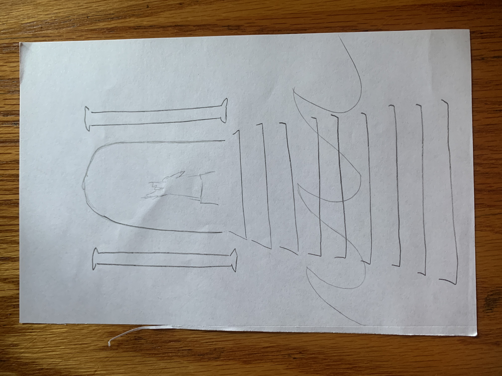
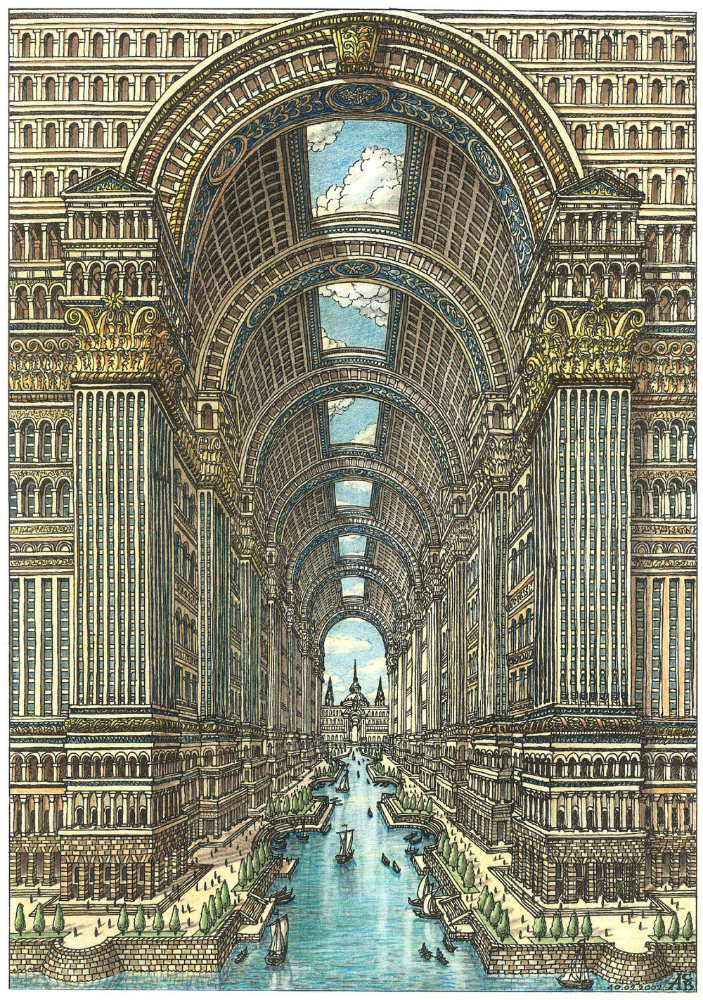
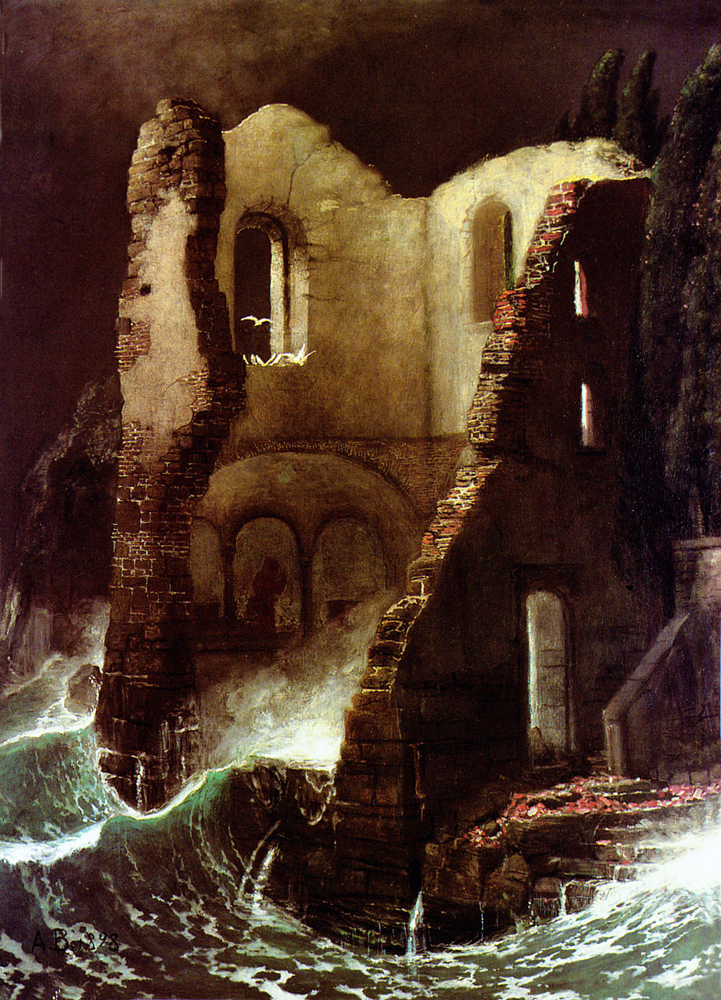
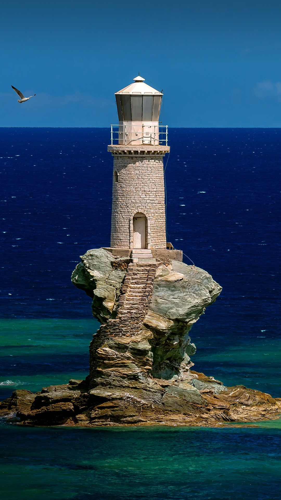
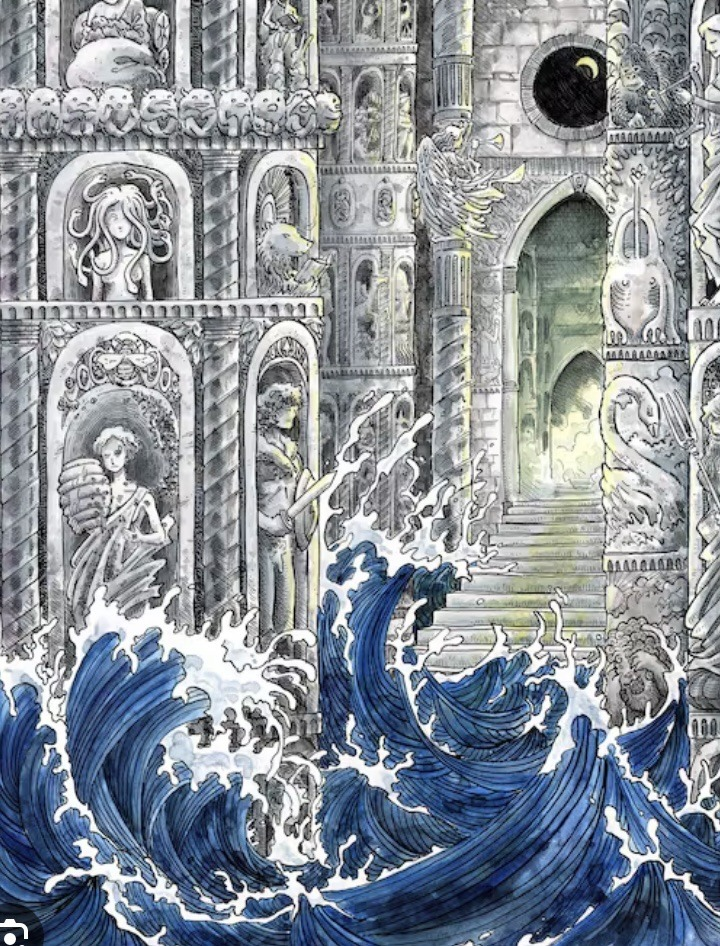
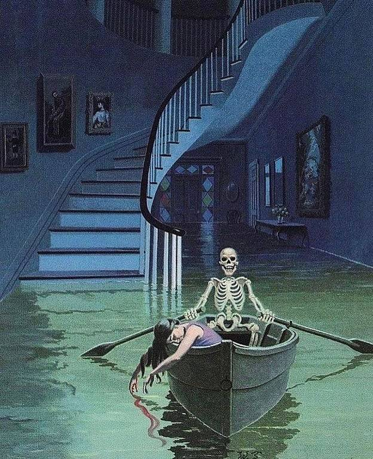

# Milestone 3
This week I created and added a background representing the house where Piranesi takes place. I took inspiration by the [Carceri series by Giovanni Battista Piranesi](https://en.wikipedia.org/wiki/Carceri_d%27invenzione) which is also where the book and titular protagonist gets their names. I found a bunch of different architectural photos, removed their backgrounds, played with the color to make things cohesive, and then added statues as in the novel. I had also experimented with individually uploading and placing images in the canvas but it ended up being much easier and better looking to create one single image besides the albatross. 

In terms of code I added smaller swells at regular time intervals, and tweaked the big click-activated swell to start at whatever height the waves happened to be at the time of the click. I made some additional minor tweaks to better situate the waves and bird against the background and otherwise make the interaction smoother. 

# Milestone 2
This week I tried to tackle the generative elements of my midterm that seemed the most difficult: the tidal movement and color gradient, an interactive swelling effect for the waves, and an albatross flying across the screen. I used a custom function to draw the waves which I adapted from a [project in the p5js library](https://editor.p5js.org/pippinbarr/sketches/bgKTIXoir). They move across the screen in semi-regular but staggered motions that create a water-y effect. I also adapted the color range based on one of my inspiration photos, though I might reverse the gradient once I add the background collage and see which option I like better. 

In addition to the base waves which use noise(), I also created a swell effect that rises and subsides in a loop. Initially I had it increase incrementally based on mouse clicks but I wanted it to be a smoother animation so now it’s just triggered once. 

Finally I uploaded an image of an albatross with a transparent background and added code to have it fly across the screen in a looping sin wave. I initially explored something more like [this p5js library repo](https://editor.p5js.org/KatalinVarga/sketches/rT-XktCX-) but I wanted to finally use sin/cos SOMEwhere so for now it moves in a very regular pattern. 

Next week I will work on the background which will be a collaged grand hall. I’ll need to find some Greek-looking interiors/statues/etc, make the background transparent if necessary, and then combine them in the function(setup) section. I’ll probably have to make some tweaks to my code based on how the background goes. If I have some time I also think it would be cool to link the bird and the swell so that the bird flies off if the swell is activated.

# Milestone 1
I want to illustrate a cover for [Piranesi](https://en.wikipedia.org/wiki/Piranesi_(novel)), by Susanna Clarke. In the novel, the narrator lives alone an enormous house full of statues with a grand staircase. The lower halls of the house are flooded and the world of the house is so huge that the narrator experiences tides.

I’d like to depict the main hall and staircase as static shapes with tides going in and out, with maybe some smaller lapping of waves and one big swell. In the book the narrator has to be attentive to and respectful of the tides; other characters attempt to control them or subvert them with negative consequences so I think a time-based project is more appropriate than an interactive one. 

It would be cool to achieve a color gradient of some kind within the water. I want to use sin/cos or other methods to create movement that loops instead of resetting. I plan to use custom functions, objects, for() loops and if() statements. Other ideas I have are to use images to create the background in a more collage-y way or to include birds (another major plot element) flying in and out.

Thematically I think this project reminds me the most of the readings on interactivity. Even though I plan to do a time-based animation there’s a theme throughout the novel about the relationship the world/our real world and the house where the narrator lives, and how each is responsive to the other. 

Below is a conceptual sketch and some inspiration images I collected.

